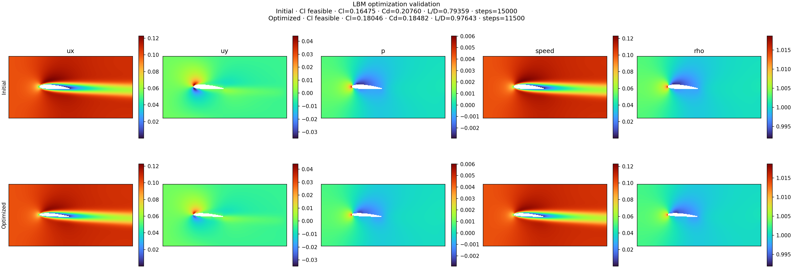
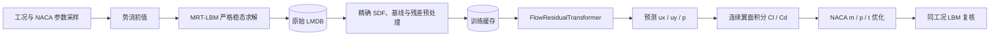
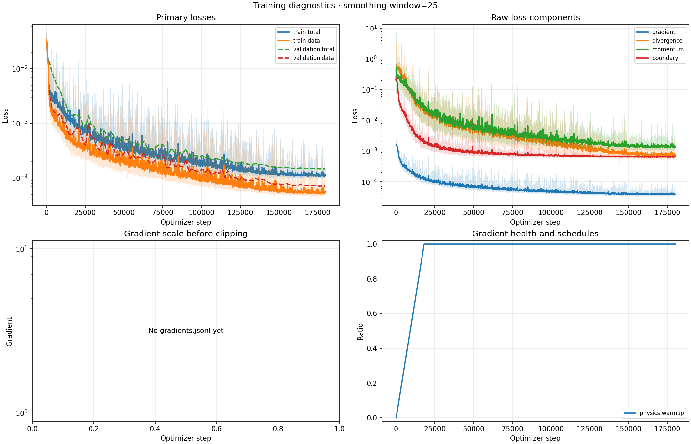
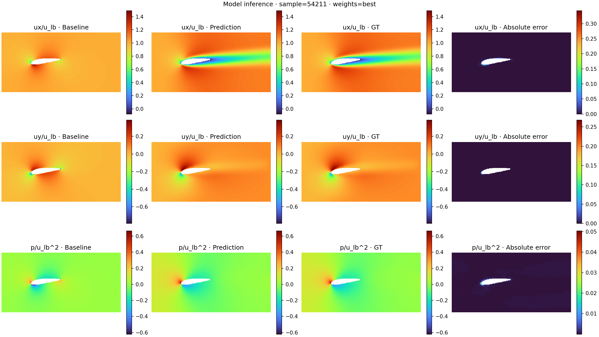
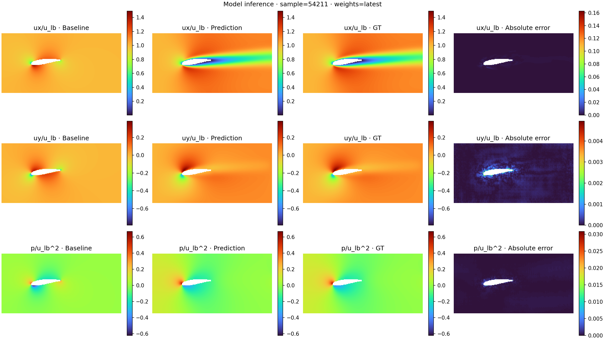

# AIRocket

> 面向二维 NACA 翼型的稳态流场数据生成、物理约束代理建模与可微参数优化工具链。

AIRocket 将严格稳态 MRT-LBM、无粘源面元基线、流场残差 Transformer 和 NACA
连续参数优化串成一条可复现流水线：先生成收敛的黏性流场标签，再训练代理模型，最后只
优化翼型参数，并用同工况 LBM 对候选结果做独立复核。



上图是仓库内置的一次 LBM 复核资产。该案例中，初始翼型与优化翼型均满足正升力约束；
`Cl` 从 `0.16475` 提升到 `0.18046`，`Cd` 从 `0.20760` 降到 `0.18482`，`L/D`
从 `0.79359` 提升到 `0.97643`。对应变化约为 `Cl +9.54%`、`Cd -10.97%`、
`L/D +23.04%`。这些数字只描述图中的单次工况，不能替代跨工况精度评估。

## 项目能力

- **严格稳态数据生成**：D2Q9 MRT-LBM、Bouzidi 插值反弹边界、连续多次命中稳态判据、
  粗细网格续接、势流初值和相邻工况热启动。
- **参数化几何**：NACA 四位数族的 `m/p/t` 参数、余弦加密轮廓、固体掩码与精确有符号
  距离场（SDF）。
- **可恢复数据采集**：拉丁超立方或随机采样，稳定样本 ID，未收敛样本不入库，LMDB
  按样本分库并支持断点续采。
- **流场代理模型**：12 层残差 Transformer，在 SDF 与无粘源面元流场上学习黏性修正，
  三级 PixelShuffle 恢复原始分辨率。
- **物理约束训练**：数据、残差梯度、不可压散度、稳态动量、翼面、入口、出口和周期
  边界损失，并支持物理项 warmup 与梯度健康监测。
- **预训练与微调**：checkpoint 续训、独立评估、名称与形状兼容的部分权重加载，以及
  翼面邻域额外监督。
- **可微翼型优化**：冻结模型权重与计算网格，只更新声明为可训练的 NACA 连续参数；
  支持升力、阻力、升阻比和目标升力约束。
- **完整可视化**：原始流场、训练曲线、代理模型推理误差，以及优化前后 LBM 对比与
  原始数组导出。

## 工作流总览



三类结果的证据边界不同：

1. 训练损失和代理推理图说明模型在给定缓存与样本上的拟合表现。
2. 优化日志说明代理目标沿可微路径发生了变化。
3. 只有优化前后都收敛的同工况 LBM 复核，才能确认该候选在当前离散模型与目标下有效。

## 结果展示

### 训练诊断



曲线面板同时呈现训练/验证目标、各物理损失、梯度统计和物理项 warmup。图中这次运行
没有 `gradients.jsonl`，所以左下角只显示缺失提示；若在配置中开启
`training.gradient_monitor`，后续运行会写出裁剪前梯度规模和小梯度比例。

### 预训练与微调推理

| 预训练 checkpoint | 微调 checkpoint |
| --- | --- |
|  |  |

两图均展示样本 `54211` 的 Baseline、Prediction、GT 和 Absolute error，覆盖
`ux/u_lb`、`uy/u_lb` 与 `p/u_lb²`。各误差面板使用各自色标，适合观察误差空间分布；
定量比较应读取评估指标，不能只比较颜色深浅。

### 优化结果的 LBM 复核

页面顶部的 `assets/lbm_comparison.png` 使用相同行色标并排展示初始与优化翼型的
`ux/uy/p/speed/rho`。复核命令还会同时保存结构化报告和完整场数组，便于重新计算指标，
而不是只依赖图片判断。

## 环境准备

项目以 PowerShell 命令为主。当前仓库没有依赖锁文件；核心第三方依赖为：

- Python 3.10 或更高版本；当前工作区使用 Python 3.12。
- PyTorch 2.x。
- NumPy、LMDB、PyYAML、Matplotlib。

正式 LBM 数据生成和模型训练建议使用 CUDA GPU。CPU 路径适合小规模调试与数值检查，
不应据此估计正式任务吞吐。

```powershell
git clone <repository-url> AIRocket
Set-Location AIRocket

py -3.12 -m venv .venv
.\.venv\Scripts\python.exe -m pip install --upgrade pip
.\.venv\Scripts\python.exe -m pip install torch numpy lmdb pyyaml matplotlib
```

如需 CUDA，请按目标 GPU 与驱动选择对应的 PyTorch 构建。安装后可做最小导入检查：

```powershell
.\.venv\Scripts\python.exe -c "import torch, numpy, lmdb, yaml, matplotlib; print(torch.__version__, torch.cuda.is_available())"
```

所有入口应从仓库根目录调用，并直接使用项目虚拟环境中的 Python，避免系统 Python 与
项目依赖混用。

## 配置系统

[`config/default.yaml`](config/default.yaml) 是全部运行参数的唯一默认来源；
[`config/schema.py`](config/schema.py) 定义类型和加载期约束。`--env` 指向的 YAML 会与
默认配置递归合并，因此实验文件只需写需要覆盖的叶子。

例如，先建立一个用于熟悉流程的 `config/experiment.yaml`：

```yaml
device: auto

sampler:
  num_samples: 16

solver:
  batch_size: 4

storage:
  path: output/flowfield-experiment

training_data:
  cache_path: output/training-cache-experiment

training:
  epochs: 2
  batch_size: 2
  max_steps: 50
  torch_compile: false
  output_dir: output/training-experiment

vis:
  out_dir: output/vis-experiment

optimization:
  checkpoint: output/training-experiment/best.pt
  output_dir: output/optimization-experiment
  steps: 50
```

这只是小预算流水线示例，不是精度实验。LBM 只保存达到严格稳态判据的样本，因此 16 个
计划样本不保证全部入库；若有效样本不足以形成非空训练/验证/测试划分，应增加样本预算。

相对路径统一锚定到项目根，而不是当前启动目录。建议显式覆盖 `storage.path`、
`training_data.cache_path`、`training.output_dir`、`vis.out_dir` 和
`optimization.output_dir`，以免不同实验共用产物。加载器一次只接受一个 `--env` 文件；
需要组合“本机路径 + 微调参数”时，应写成同一个覆盖 YAML。

主要配置段如下：

| 配置段 | 作用 | 关键参数 |
| --- | --- | --- |
| `grid` | 计算域与几何分辨率 | `nx`, `ny`, `chord`, `x_le`, `y_center` |
| `solver` | MRT-LBM 与稳态策略 | `boundary`, `max_steps`, `conv_tol`, `steady_hits`, `grid_sequence_policy` |
| `airfoil` | 几何和 SDF | `n_points`, `sdf_chunk_cpu`, `sdf_chunk_cuda`, `sdf_backward_epsilon` |
| `sampler` | 工况空间 | `num_samples`, `reynolds`, `mach`, `aoa_deg`, `naca_m/p/t` |
| `storage` | 原始 LMDB | `path`, `map_size_mb`, `reader_cache_size` |
| `training_data` | 独立训练缓存 | `cache_path`, `split`, `compression_level`, `prepare_*` |
| `model` | Transformer 结构 | `patch_size`, `dim`, `depth`, `heads`, `ffn_hidden` |
| `training` | 优化器与运行预算 | `epochs`, `batch_size`, `gradient_accumulation`, `lr`, `amp_dtype` |
| `loss` | 数据与物理约束权重 | `data_weight`, `edge_data_weight`, `gradient/divergence/momentum/boundary_weight` |
| `vis` | 图像输出 | `out_dir`, `fields`, `dpi`, `training_curve_smoothing` |
| `optimization` | 翼型参数与目标 | `flow`, `parameters`, `objective`, `surface_offset_cells` |

单位必须特别注意：LBM 使用格子单位，`u_lb` 不是 m/s。核心关系为：

```text
u_lb  = Ma / sqrt(3)
nu_lb = u_lb * chord / Re
tau   = nu_lb / (1/3) + 0.5
```

映射回物理量时还需要指定物理弦长和物理来流速度。不要把配置里的格子速度直接解释成
真实世界速度。

## 从数据到模型

下面使用同一个实验覆盖文件，确保数据、缓存、checkpoint 和可视化路径彼此一致：

```powershell
$AirRocketConfig = "config\experiment.yaml"
```

### 1. 生成严格稳态流场

```powershell
.\.venv\Scripts\python.exe data\run.py --env $AirRocketConfig --read
```

采集器会按确定性采样表生成工况，分批求解并仅写入收敛样本。中断后重新执行同一命令
即可跳过已入库 ID；修改主 `seed`、样本总数、采样方法或关键配置后，不应把新计划与旧库
混用。`--read` 会在采集结束后读取一个样本并打印元数据，用于验证存储接口。

原始库结构为：

```text
<storage.path>/
├── meta.lmdb/
├── sample_00000000.lmdb/
├── sample_00000001.lmdb/
└── ...
```

每个有效样本保存 `rho/ux/uy/p/mask` 等稳态场、实际格子工况、NACA 参数、随机种子、
收敛状态和粗/细网格步数。样本 ID 来自原始采样计划，遇到未收敛样本时可以存在空洞。

### 2. 查看原始流场

```powershell
.\.venv\Scripts\python.exe vis\run.py --env $AirRocketConfig
.\.venv\Scripts\python.exe vis\run.py --env $AirRocketConfig --indices 0 7 12
```

不指定 `--indices` 时按 `vis.num_samples` 渲染；指定的 ID 不存在时会告警并跳过。

### 3. 构建训练缓存

```powershell
.\.venv\Scripts\python.exe train\run.py --env $AirRocketConfig --mode prepare
```

原始 LMDB 在此过程中始终只读。准备阶段会计算精确 SDF、无粘源面元基线、监督残差、
训练集统计量和数据指纹，并写入独立缓存及 `manifest.json`。进度显示完成后仍可能继续执行
统计、manifest 写入、LMDB 同步与关闭；应等待进程正常退出再启动训练。

### 4. 训练或断点续训

```powershell
# 从头训练
.\.venv\Scripts\python.exe train\run.py --env $AirRocketConfig --mode train

# 恢复模型、优化器、调度器、epoch 与 global_step
.\.venv\Scripts\python.exe train\run.py --env $AirRocketConfig --mode train `
  --checkpoint output\training-experiment\latest.pt
```

训练使用单卡。`training.batch_size` 是 micro-batch；名义有效批量为
`batch_size × gradient_accumulation`。`global_step` 只在 `optimizer.step()` 后增加。
默认 CUDA 主干使用自动混合精度，场重建和物理损失保留 FP32；CPU 路径全程 FP32。

主要训练产物：

- `latest.pt`：最近一次保存的完整训练状态。
- `best.pt`：按验证集 `data` 指标选择的最佳 checkpoint。
- `metrics.jsonl/csv`：训练损失、学习率与物理项权重。
- `validation.jsonl/csv`：逐 epoch 验证指标。
- `gradients.jsonl/csv`：开启梯度监测后生成。
- `visuals/` 与 `evaluation/`：训练期和独立评估图。

### 5. 评估、训练曲线与推理图

```powershell
.\.venv\Scripts\python.exe train\run.py --env $AirRocketConfig --mode eval `
  --checkpoint output\training-experiment\best.pt

.\.venv\Scripts\python.exe vis\run.py --env $AirRocketConfig --training-curves

.\.venv\Scripts\python.exe vis\run.py --env $AirRocketConfig --inference `
  output\training-experiment\best.pt --indices 0 7
```

推理图将 Baseline、Prediction、GT 和 Absolute error 并排显示。checkpoint 推理会检查
训练缓存指纹，防止在错误的数据尺度或几何配置下生成表面正常但语义无效的结果。只加载
可信来源的 PyTorch checkpoint。

### 6. 微调

仓库提供 [`config/finetune.yaml`](config/finetune.yaml) 作为覆盖示例：当前配置使用
10 个 epoch、`2e-5` 学习率，并对翼面外 4 格子范围增加 `0.5` 的数据损失权重。

```powershell
.\.venv\Scripts\python.exe train\run.py --env config\finetune.yaml --mode finetune `
  --checkpoint output\training\best.pt
```

微调只加载名称和形状兼容的模型参数，不恢复旧优化器、调度器、epoch 或 global step；
被跳过的参数会记录到新 checkpoint 的 `pretrained` 字段。默认微调结果写入独立目录，
不会覆盖预训练 checkpoint。若预训练使用自定义路径，应建立包含这些路径和微调超参数的
单一覆盖 YAML。

## 翼型参数优化

优化路径为：

```text
NACA m/p/t
  -> 连续轮廓与 SDF / 源面元基线
  -> 冻结的 FlowResidualTransformer
  -> 连续翼面采样与 Cl/Cd 积分
  -> 目标函数
```

计算网格和模型权重全程冻结；只有 `optimization.parameters` 中 `fixed: false` 的参数会被
更新。可选目标：

- `maximize_lift`：最大化 `Cl`。
- `minimize_drag`：最小化平滑 `|Cd|`。
- `maximize_lift_to_drag`：在正升力可行区最大化升阻比。
- `target_lift_min_drag`：逼近指定升力并降低阻力。

推荐为每个优化实验建立单独覆盖文件：

```yaml
optimization:
  checkpoint: output/training/best.pt
  output_dir: output/optimization-demo
  steps: 300
  flow:
    u_lb: 0.12
    reynolds: 350.0
    aoa_deg: 5.0
  parameters:
    naca_m:
      bounds: [0.00, 0.05]
      initial: 0.02
      fixed: false
    naca_p:
      bounds: [0.30, 0.50]
      initial: 0.40
      fixed: true
    naca_t:
      bounds: [0.10, 0.16]
      initial: 0.12
      fixed: false
  objective:
    mode: target_lift_min_drag
    target_lift: 0.6
    minimum_lift: 0.01
    lift_constraint_weight: 10.0
    lift_weight: 1.0
    drag_weight: 0.1
```

```powershell
.\.venv\Scripts\python.exe train\run.py --env config\my_optimize.yaml `
  --mode optimize --checkpoint output\training\best.pt
```

优化输出包括：

- `history.csv`：逐步参数、目标、`Cl/Cd`、升阻比和可行性。
- `result.json`：固定工况、初始候选、全程最佳候选和最终状态。

当前实现要求 checkpoint 与 `training_data.cache_path/manifest.json` 的缓存指纹一致，并从
该 manifest 读取归一化统计量，因此运行优化时仍需保留匹配的训练缓存。参数或工况超出
训练数据覆盖范围时属于代理模型外推，优化器收敛不等于气动结果可信。

### 使用 LBM 独立复核

```powershell
.\.venv\Scripts\python.exe vis\run.py --env config\my_optimize.yaml `
  --optimization-lbm output\optimization-demo\result.json
```

复核程序读取初始与最佳参数，以同一批、同一工况和同一求解配置运行 LBM，并生成：

- `lbm_comparison.png`：同色标初始/优化流场图。
- `lbm_report.json`：收敛步数、实际工况、气动力与改善判定。
- `lbm_fields.npz`：两组 `rho/ux/uy/p/mask` 原始数组。

只有报告同时满足以下条件，才能判定 LBM 确认了有效改善：

```text
both_converged == true
lbm_positive_lift_feasible == true
lbm_objective_improved == true
```

## 数值与模型设计

### MRT-LBM

- D2Q9 多松弛时间碰撞模型；剪切模态松弛率由 `tau` 决定。
- 默认 Bouzidi 插值反弹以提高曲面边界精度，也可配置普通 bounce-back。
- 连续 `steady_hits` 次达到相对速度变化阈值后才判稳态。
- 势流只是初始化场，不作为黏性标签；失败或发散样本不会入库。
- `grid_sequence_policy: auto` 仅在冷启动时使用粗网格，有完整稳态延续时直接进入细网格。

### 流场残差 Transformer

模型不从零生成流场，而是学习相对无粘基线的归一化残差：

```text
[(ux-u0x)/u_lb, (uy-u0y)/u_lb, (p-p0)/u_lb²]
p0 = 0.5 * (u_lb² - |u0|²)
```

默认 `128×256` 网格和 `8×8` patch 形成 512 个 token。主干为 12 个 Pre-RMSNorm、
6 头全局注意力 Transformer block，默认维度 384；三级 `×2` PixelShuffle 解码器恢复
原空间分辨率。SDF、实际雷诺数、格子黏度和来流速度共同提供几何与工况条件。

### 损失语义

`data` 是流体节点上三通道归一化残差的 Huber loss，不包含物理项；`total` 才是数据、
残差梯度和 warmup 后各物理约束的加权和。微调的 `edge_data` 只作用于翼型外部、指定
距离内的流体节点，不会改变全域 `data` 指标的定义。

### 可微边界

`m/t -> NACA 坐标` 连续；`p` 的弯度公式在分段切换处是分段可微。点到折线的 SDF 在
最近线段切换、投影截断和边界采样处存在局部折点，但在绝大多数位置可导。布尔固体掩码
本身不可微，只负责离散物理边界；优化梯度主要经连续 SDF、面元基线、代理场与连续表面
积分传播。`clamp(sdf/chord, -1, 1)` 会让远场饱和区域的 SDF 梯度为零。

## 目录结构

```text
AIRocket/
├── assets/                    # README 使用的训练、推理与 LBM 结果图
├── config/
│   ├── default.yaml           # 唯一默认配置
│   ├── finetune.yaml          # 微调覆盖示例
│   └── schema.py              # 配置类型与约束
├── data/
│   ├── aerodynamics/          # Cl/Cd 与优化目标
│   ├── airfoil/               # NACA 几何、掩码与 SDF
│   ├── collector/             # 采集与断点续采编排
│   ├── lbm_solver/            # D2Q9 MRT-LBM
│   ├── potential_initializer/ # 源面元势流初值
│   ├── sampler/               # 工况采样
│   ├── storage/               # 原始 LMDB
│   ├── training_cache/        # 模型输入与残差缓存
│   └── run.py                 # 数据 CLI
├── model/flow_transformer/    # 流场残差 Transformer
├── train/
│   ├── airfoil_optimization/  # NACA 参数优化
│   ├── engine/                # 训练、评估、续训与冒烟
│   ├── fine_tuning/           # 兼容权重加载与微调
│   ├── losses/                # 数据与物理损失
│   └── run.py                 # 训练 CLI
├── vis/                       # 流场、曲线、推理和 LBM 复核
├── Doc/                       # 设计、基准与开发规范
└── LICENSE                    # Apache-2.0
```

## 校验与开发约定

各模块的 `checks/` 目录存放就近输入与状态校验，它们主要由运行路径调用，并不是一个独立
pytest 测试套件。提交前至少执行语法编译和补丁空白检查：

```powershell
.\.venv\Scripts\python.exe -m compileall config data model train vis
git diff --check
```

项目约定：

- 实验参数进入 `config/default.yaml` 和 `config/schema.py`，环境差异写覆盖 YAML。
- 新模块保留中文文件头与必要注释，校验逻辑下沉到同级 `checks/`。
- 新增或移动源码后同步更新 [`Doc/Index.md`](Doc/Index.md)。
- 性能改动使用固定样本做单变量 A/B，并同时报告耗时与数值误差。

完整规范见 [`Doc/开发规范.md`](Doc/开发规范.md)。

## 常见问题

### 为什么计划样本数和实际 LMDB 数量不同？

只有满足严格稳态判据的样本才会写入数据库；未收敛或数值发散会留下样本 ID 空洞。查看
采集日志中的实际 `u_lb/tau`、收敛步数和失败原因，而不是假设 ID 必须连续。

### 为什么 CPU 运行很慢？

默认网格、批量和样本预算面向正式数据生成。CPU 主要用于小样本诊断；应通过覆盖 YAML
降低样本数和批量，并在正式任务上使用 CUDA。CPU 基准不能直接外推 GPU 性能。

### 为什么缓存进度到 100% 后进程还没有结束？

样本写入完成后还要计算统计量、写入 manifest、同步并关闭 LMDB。等待最终完成日志和
正常进程退出；不要在这些尾部步骤完成前并发启动训练。

### 为什么 checkpoint 无法用于推理或优化？

检查模型结构、网格、训练缓存路径及 `cache_fingerprint` 是否一致。续训和推理要求匹配
缓存语义；微调可跳过不兼容参数，但会建立新的优化状态。当前优化流程也需要匹配缓存的
`manifest.json`。

### `torch.compile` 失败怎么办？

LBM 和训练代码都保留 eager 回退路径。可在覆盖 YAML 中将对应的 `torch_compile` 设为
`false`，先确认数值流程正确，再针对目标平台单独做性能验证。

### 代理优化成功是否等于 CFD 已验证？

不等于。`history.csv` 和 `result.json` 只记录代理模型目标；必须运行 LBM 复核并检查
收敛、正升力可行性与目标改善三个条件。超出训练分布的候选还需要更严格的独立验证。

## 延伸文档

- [`Doc/模型训练.md`](Doc/模型训练.md)：输入输出、模型结构、精度边界、损失与日志语义。
- [`Doc/翼型优化.md`](Doc/翼型优化.md)：优化配置、目标函数、可微路径和 LBM 复核。
- [`Doc/稳态加速.md`](Doc/稳态加速.md)：稳态策略、固定样本基准与已否决方案。
- [`Doc/Index.md`](Doc/Index.md)：源码与文档导航。

## 许可证

本项目使用 [Apache License 2.0](LICENSE)。
